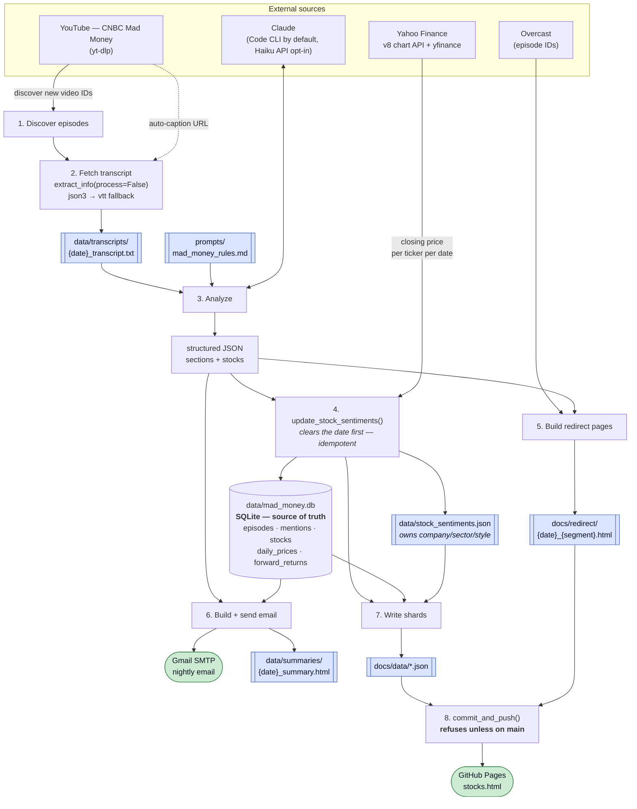
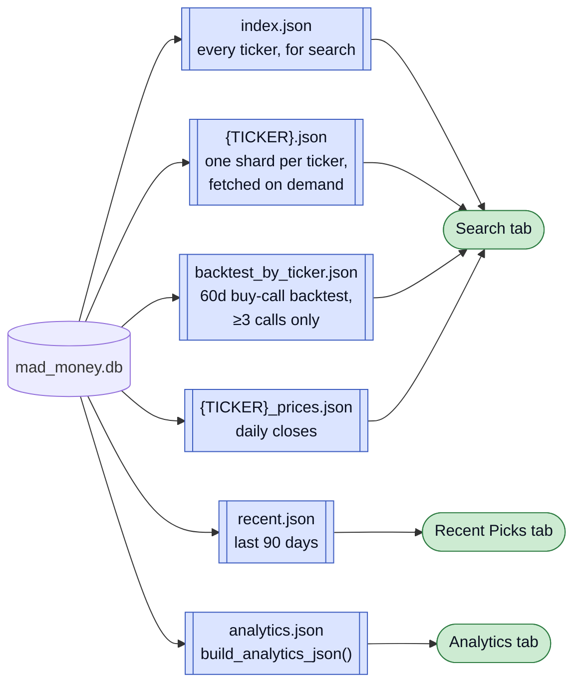
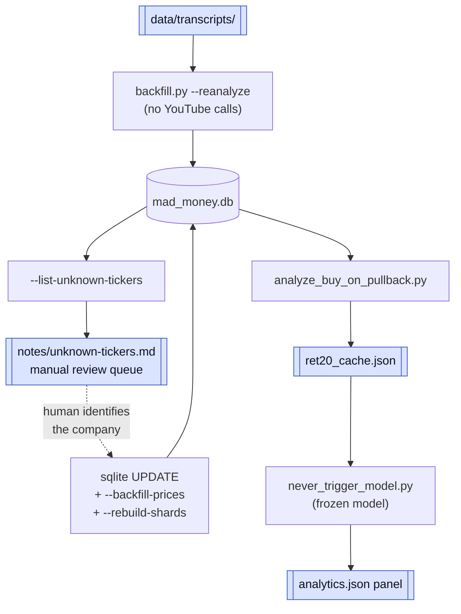

# Data Flow — From YouTube to Finished Products

How raw episode audio becomes the nightly email and the GitHub Pages site.
Everything below is produced by `code/pipeline.py` unless noted.

---

## The nightly run

| Box | Meaning |
|-----|---------|
| Blue, double-edged | a stored file or directory on disk |
| Green, rounded | a delivered product — the nightly email, the live site |
| Plain rectangle | a processing step in `pipeline.py` |
| Cylinder | the SQLite database (source of truth) |

---

## Stage detail

| # | Stage | Reads | Writes |
|---|-------|-------|--------|
| 1 | Discover | YouTube channel via yt-dlp | `data/processed_episodes.json` |
| 2 | Transcript | YouTube auto-captions (json3, else vtt) | `data/transcripts/`, `data/transcript_timing.csv` |
| 3 | Analyze | transcript + `prompts/mad_money_rules.md` | in-memory JSON |
| 4 | Persist | analysis + Yahoo closing prices | SQLite, `data/stock_sentiments.json` |
| 5 | Redirects | Overcast ID cache | `docs/redirect/` |
| 6 | Email | analysis + DB (charts via matplotlib) | SMTP send, `data/summaries/` |
| 7 | Shards | SQLite + `stock_sentiments.json` | `docs/data/` |
| 8 | Publish | everything dirty under `docs/` + `data/` | `main` &rarr; GitHub Pages |

---

## What each site file is for

`stocks.html` is fully client-side — it fetches these JSON files and renders
everything in the browser. There is no backend.

---

## Off the nightly path

These are run by hand and are **not** part of the cron.

---

## Invariants worth not breaking

**SQLite is the source of truth for mention data.** `stock_sentiments.json` is
authoritative only for `company` / `sector` / `style`. `--rebuild-shards` calls
`_sync_mentions_from_db()` first, so after any manual DB edit a rebuild is all
that's needed — never hand-edit mentions in the JSON.

Note the direction reverses for names: `upsert_stock()` writes the JSON's company
name *into* the DB, so a name must be corrected in `stock_sentiments.json` or a
later `--fetch-sectors` will overwrite it.

**Re-processing a date replaces it.** `update_stock_sentiments()` clears the date's
mentions before writing. This matters because `UNIQUE(episode_id, ticker, segment)`
only rejects an *exact* repeat — before the clear existed, a re-analysis that moved
a call to another segment, or named the same company under a different ticker, left
both rows in place and nothing looked wrong. See BUG-010.

**`main` owns every generated artifact.** `docs/data/`, `docs/redirect/`,
`data/daily_prices/`, and the four `data/*.json` state files may only be committed
on `main`; `.githooks/pre-commit` enforces it. The cron therefore runs from a
main-pinned worktree (`~/Documents/DS/yt-words-cron`), and `commit_and_push()`
refuses to run anywhere else.

**Index comparisons are paired.** Any "vs. the S&P" figure subtracts the index's
return over *that call's own* window before aggregating. Never median-of-returns
minus median-of-index — see the paired-excess rule in `CLAUDE.md`.

**Everything is measured inside one ~6-month AI-driven bull market (Jan–Jul 2026).**
Every analytics panel carries that caveat on the site.
